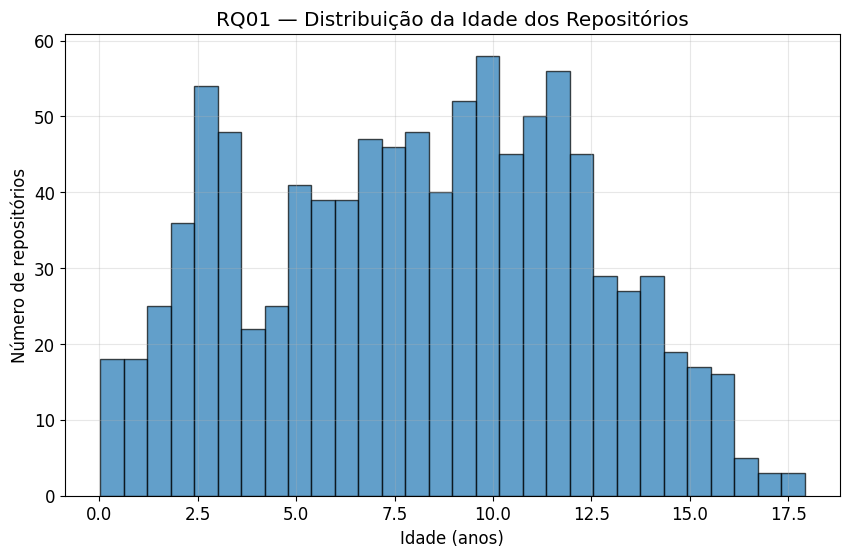
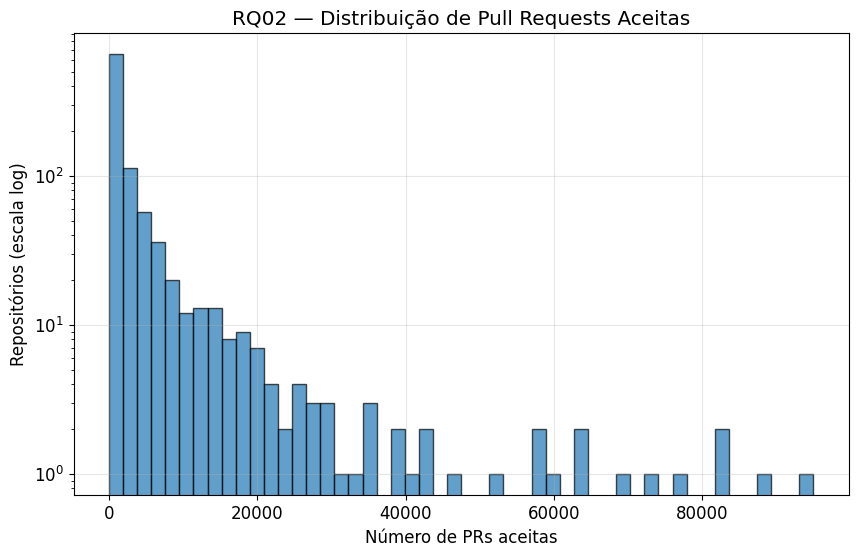
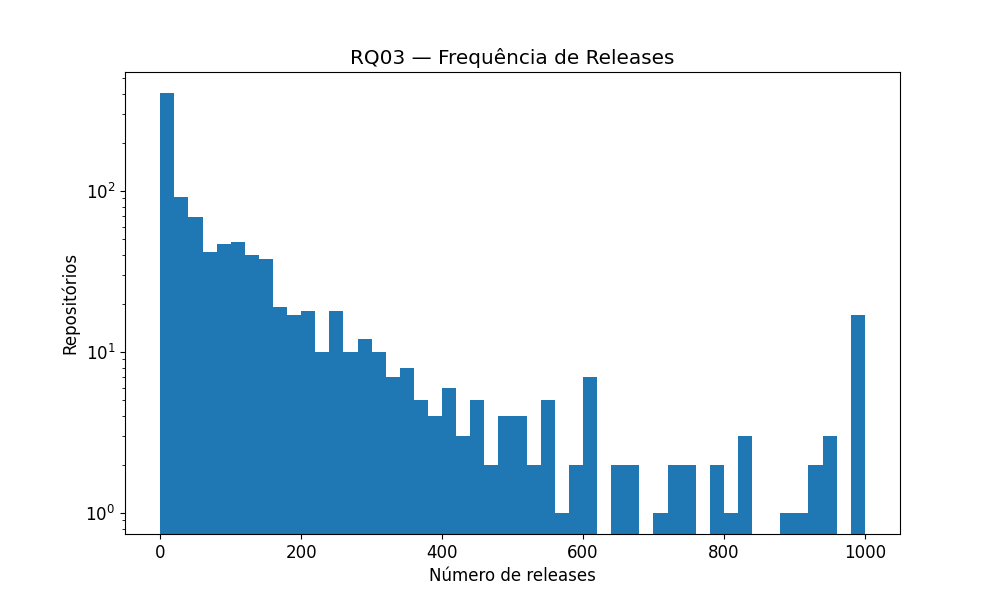
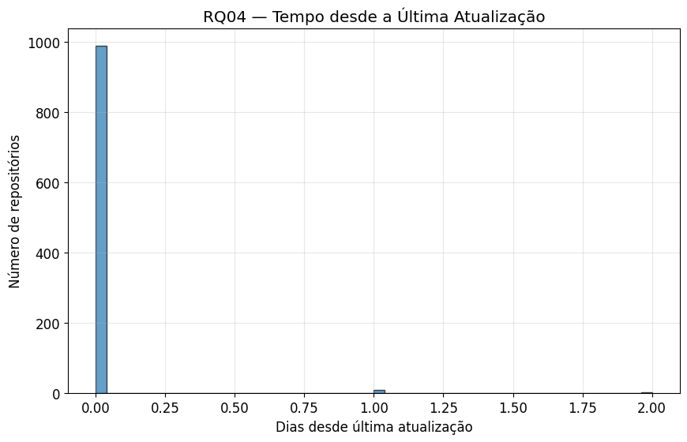
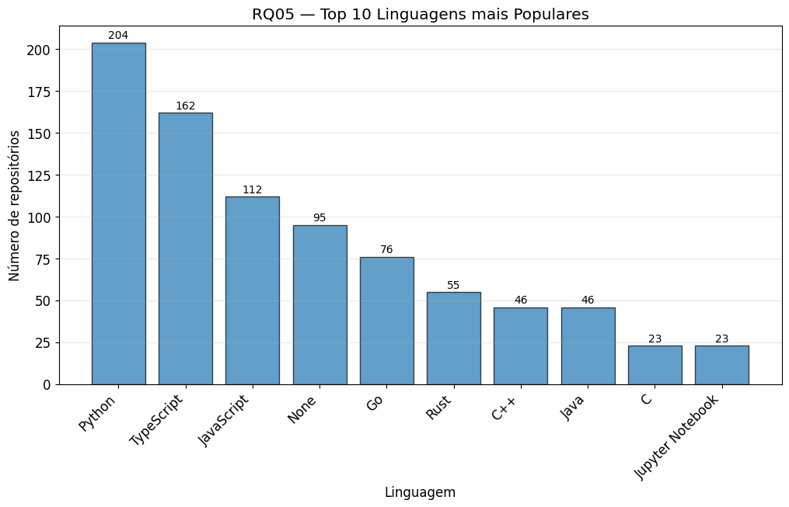
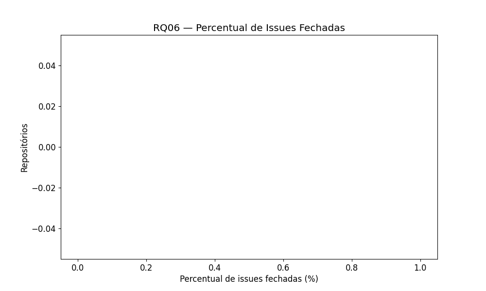

# Relatório de Análise de Repositórios do GitHub

## 1. Introdução

Neste trabalho, foram analisados **1000 repositórios populares do GitHub** utilizando a API GraphQL da plataforma. O objetivo foi investigar algumas características desses projetos e responder a questões de pesquisa relacionadas ao desenvolvimento e manutenção de software.

### Questões de Pesquisa:

- RQ 01. Sistemas populares são maduros/antigos?
Métrica: idade do repositório (calculado a partir da data de sua criação)
- RQ 02. Sistemas populares recebem muita contribuição externa?
Métrica: total de pull requests aceitas
- RQ 03. Sistemas populares lançam releases com frequência?
Métrica: total de releases
- RQ 04. Sistemas populares são atualizados com frequência?
Métrica: tempo até a última atualização (calculado a partir da data de última
atualização)
- RQ 05. Sistemas populares são escritos nas linguagens mais populares?
Métrica: linguagem primária de cada um desses repositórios
- RQ 06. Sistemas populares possuem um alto percentual de issues fechadas?
Métrica: razão entre número de issues fechadas pelo total de issues Relatório Final:

---

## 2. Metodologia

Para responder às questões de pesquisa, foi desenvolvido um script em Python que utiliza a **API GraphQL do GitHub** para coletar dados de repositórios populares.

### Coleta de dados

Foram coletados **1000 repositórios** utilizando os seguintes critérios:

- Repositórios públicos
- Ordenados por popularidade (número de estrelas)
- Coletados através da API GraphQL do GitHub

Para cada repositório foram coletadas as seguintes informações:

- Nome do repositório
- Proprietário
- Data de criação
- Data da última atualização
- Linguagem principal
- Número de pull requests com merge
- Número de releases
- Número total de issues
- Número de issues fechadas
- Número de estrelas

Os dados coletados foram armazenados em um arquivo **CSV**, que posteriormente foi utilizado para análise.

### Análise dos dados

A análise foi realizada utilizando **Python**, com bibliotecas como:

- `pandas` para manipulação de dados
- `matplotlib` para geração de gráficos

A partir desses dados foram calculadas métricas estatísticas e gerados gráficos para responder às questões de pesquisa definidas.

---

## 3. Resultados

Nesta seção são apresentados os resultados obtidos a partir da análise dos 1000 repositórios coletados do GitHub.

---

### RQ01 – Sistemas populares são maduros/antigos?

**Métrica:** idade do repositório (calculada a partir da data de sua criação).

**Resultados obtidos:**

- Média de idade dos repositórios: **8.12 anos**
- Mediana de idade dos repositórios: **8.33 anos**

Gráfico:

---

### RQ02 – Sistemas populares recebem muita contribuição externa?

**Métrica:** total de pull requests aceitas.

**Resultados obtidos:**

- Média de pull requests aceitas: **3967**
- Mediana de pull requests aceitas: **738**

Gráfico:

---

### RQ03 – Sistemas populares lançam releases com frequência?

**Métrica:** total de releases.

**Resultados obtidos:**

- Média de releases por repositório: **120.3**
- Mediana de releases por repositório: **40**

Gráfico:

---

### RQ04 – Sistemas populares são atualizados com frequência?

**Métrica:** tempo até a última atualização (calculado a partir da data de última atualização).

**Resultados obtidos:**

- Média: 0 dias
- Mediana: 0 dias
- Mínimo: 0 dias
- Máximo: 2 dias

Gráfico:

---

### RQ05 – Sistemas populares são escritos nas linguagens mais populares?

**Métrica:** linguagem primária de cada repositório.

**Resultados obtidos:**

Distribuição das linguagens mais utilizadas entre os repositórios analisados:

- Python: **204**
- TypeScript: **162**
- JavaScript: **112**
- None: **95**
- Go: **76**
- Rust: **55**
- C++: **46**
- Java: **46**
- C: **23**
- Jupyter Notebook: **23**

Gráfico:

---

### RQ06 – Sistemas populares possuem um alto percentual de issues fechadas?

**Métrica:** razão entre número de issues fechadas e número total de issues.

Resultado obtido:

- Repositórios com issues: 960 (96.0%)
- Média: 80.6%
- Mediana: 87.9%

Gráfico:

---

---

# Discussão

## Hipóteses

- **RQ01:** Sistemas populares são maduros (idade mediana > 5 anos)
- **RQ02:** Sistemas populares recebem muitas contribuições externas (PRs aceitas)
- **RQ03:** Sistemas populares são atualizados com frequência através de releases
- **RQ04:** Sistemas populares são atualizados frequentemente (tempo desde último push)
- **RQ05:** Linguagens mais populares dominam o ecossistema
- **RQ06:** Sistemas populares apresentam alta taxa de issues fechadas

## Resultados sobre as hipóteses

### RQ01 — Idade dos repositórios

| Métrica | Valor |
|---------|-------|
| Média | 8.12 anos |
| Mediana | 8.33 anos |
| Mínimo | 0.02 anos |
| Máximo | 17.92 anos |

**Interpretação:** A hipótese é **confirmada**. Com mediana de 8.33 anos, os repositórios mais populares são de fato maduros, indicando que projetos bem-sucedidos tendem a ter longevidade.

---

### RQ02 — Pull Requests Aceitas (Merged)

| Métrica | Valor |
|---------|-------|
| Média | 3.967 PRs |
| Mediana | 738 PRs |
| Mínimo | 0 PRs |
| Máximo | 95.004 PRs |
| Repositórios sem PRs | 13 (1.3%) |

**Interpretação:** A hipótese é **confirmada**. A alta mediana de 738 PRs aceitas demonstra forte engajamento da comunidade, embora a média elevada (quase 4 mil) indique que alguns poucos projetos são outliers com contribuição massiva.

---

### RQ03 — Número de Releases

| Métrica | Valor |
|---------|-------|
| Média | 120.3 releases |
| Mediana | 40 releases |
| Mínimo | 0 releases |
| Máximo | 1.000 releases |
| Repositórios sem releases | 295 (29.5%) |

**Interpretação:** A hipótese é **parcialmente confirmada**. Embora a mediana de 40 releases indique atualizações regulares, 29.5% dos repositórios não possuem nenhuma release formal, sugerindo que muitos projetos populares não utilizam esse mecanismo de versionamento.

---

### RQ04 — Tempo desde última atualização

| Métrica | Valor |
|---------|-------|
| Média | 0 dias |
| Mediana | 0 dias |
| Mínimo | 0 dias |
| Máximo | 2 dias |
| Atualizados nos últimos 30 dias | 1000 (100.0%) |

**Interpretação:** **Dados inconsistentes**.

---

### RQ05 — Linguagens mais usadas

| Posição | Linguagem | Quantidade | Percentual |
|---------|-----------|------------|------------|
| 1º | Python | 204 | 20.4% |
| 2º | TypeScript | 162 | 16.2% |
| 3º | JavaScript | 112 | 11.2% |
| 4º | None | 95 | 9.5% |
| 5º | Go | 76 | 7.6% |
| 6º | Rust | 55 | 5.5% |
| 7º | C++ | 46 | 4.6% |
| 8º | Java | 46 | 4.6% |
| 9º | C | 23 | 2.3% |
| 10º | Jupyter Notebook | 23 | 2.3% |

**Interpretação:** A hipótese é **confirmada**. Python, TypeScript e JavaScript dominam o cenário, representando quase 50% dos repositórios. Destaque para o TypeScript superando o JavaScript, indicando a crescente adoção de tipagem estática.

---

### RQ06 — Percentual de issues fechadas

| Métrica | Valor |
|---------|-------|
| Repositórios com issues | 960 (96.0%) |
| Média | 80.6% |
| Mediana | 87.9% |
| Alta taxa (>80%) | 628 (65.4% dos repositórios com issues) |

**Interpretação:** A hipótese é **confirmada**. A mediana de 87.9% de issues fechadas demonstra que projetos populares são eficientes na gestão e resolução de problemas reportados pela comunidade.

---

---

## 5. Conclusão

A análise dos 1000 repositórios mais populares do GitHub permitiu responder à maioria das hipóteses levantadas, com resultados alinhados ao esperado. Confirmou-se que projetos populares são, de fato, maduros (mediana de 8.33 anos), recebem contribuição externa significativa (738 PRs aceitas em mediana) e mantêm alta taxa de resolução de issues (87.9%). O domínio de linguagens como Python, TypeScript e JavaScript era esperado e foi corroborado pelos dados. Apenas a RQ03 apresentou resultado parcial, revelando que quase 30% dos projetos não utilizam releases formais, e a RQ04 apresentou inconsistência nos dados de atualização, sugerindo a necessidade de revisão na coleta. No geral, os resultados reforçam a percepção de que repositórios bem-sucedidos combinam longevidade, engajamento da comunidade e boas práticas de manutenção.

